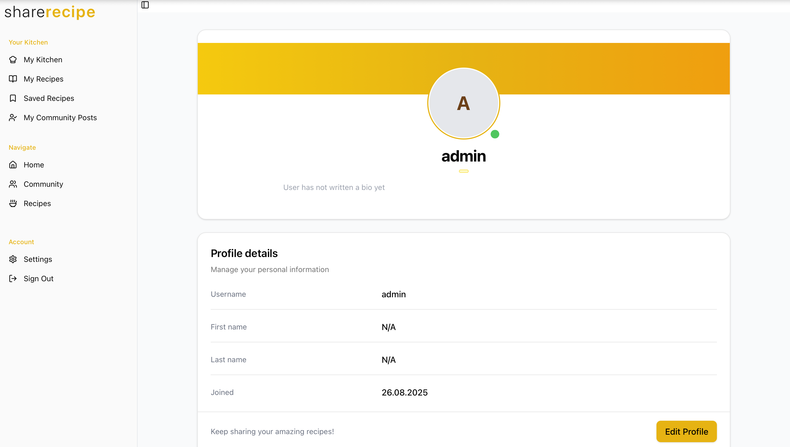

# Share Recipe – Frontend

Modern Next.js 15 (App Router) frontend for the Share Recipe platform. Provides the user interface for browsing, searching, creating and managing recipes, authenticating (email code + Google OAuth), leaving feedback, and interacting with personal kitchen features.



## Related Repositories
- Backend (FastAPI): https://github.com/bdaniyar/backend-share_recipe (see provided backend README sample)
- Fullstack (mono + infra docs): https://github.com/bdaniyar/fullstack-share_recipe

## Core Features
- Public home / marketing hero with search entry
- Recipe catalogue (list + detail pages)
- Ingredient & text search (client-side query + API integration)
- Auth flows:
  - Email signup with verification code (request + verify) & strong password rules
  - Signin with email/password
  - Google OAuth (redirect to backend PKCE flow)
  - Password reset (request code + confirm new password)
- JWT token storage (access / refresh) in localStorage (retrieved & used by API helpers)
- Profile management (edit first/last name & username)
- Create Recipe form with:
  - Dynamic steps (timers per step rendered into formatted instructions)
  - Ingredient search (debounced) & add-new (if not found and authenticated)
  - Image selection + upload post-creation
  - Advanced metadata placeholders (region, session, type, category) for future expansion
- User recipe list & edit form
- Feedback submission form
- Prevent double submissions (guards & disabled buttons) across critical forms
- Responsive layout with shared navigation & footer
- Global state via Redux Toolkit (user & recipes slices)
- UI components built on Radix primitives + Tailwind CSS 4

## Tech Stack
- Framework: Next.js 15 (App Router, React 19)
- Styling: Tailwind CSS v4, utility-first + minimal custom classes
- State: Redux Toolkit + React hooks
- UI Primitives: Radix UI (Avatar, Dialog, Popover, Select, Tooltip, etc.)
- Icons: Lucide React & custom SVGs (via SVGR)
- HTTP: Fetch + Axios (legacy usage; can be unified)
- Build: Node 18+ (Vercel / any edge-friendly host)

## Environment Variables
Create `.env.local` (not committed) in project root:
```
NEXT_PUBLIC_API_BASE_URL=https://your-backend-domain.com
```
If unset, it falls back to the Render deployment shown in `src/lib/config.js`.

## Quick Start (Local Development)
Prerequisites: Node 18+ / 20+, npm (or pnpm / yarn).

1. Install dependencies:
   ```bash
   npm install
   ```
2. Create `.env.local` with `NEXT_PUBLIC_API_BASE_URL` pointing to running backend.
3. Run dev server:
   ```bash
   npm run dev
   ```
4. Open: http://localhost:3000

## Production Build
```bash
npm run build
npm start
```

## Deployment (Vercel Recommended)
1. Import repository in Vercel dashboard
2. Set Environment Variable: `NEXT_PUBLIC_API_BASE_URL` to backend HTTPS URL
3. (Optional) Configure build: Framework = Next.js (auto-detected)
4. Deploy – incremental redeploys & image optimizations handled automatically

## API Integration Overview
- `src/lib/config.js` centralizes `API_BASE_URL`
- Recipes: create + upload image via `createRecipe` & `uploadRecipeImage`
- Profile: `fetchProfile`, `updateProfile`
- Ingredient search & add integrated into create recipe flow (debounced 300ms)

